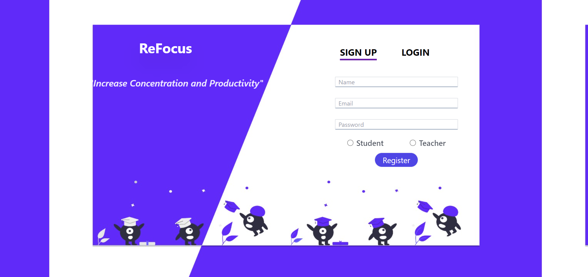
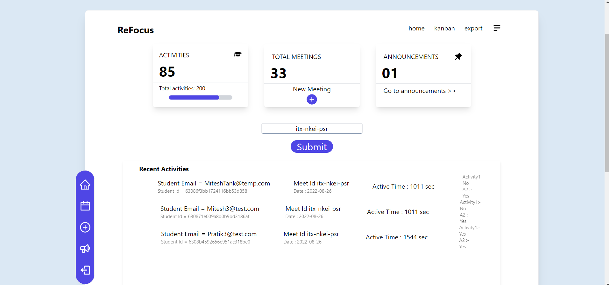
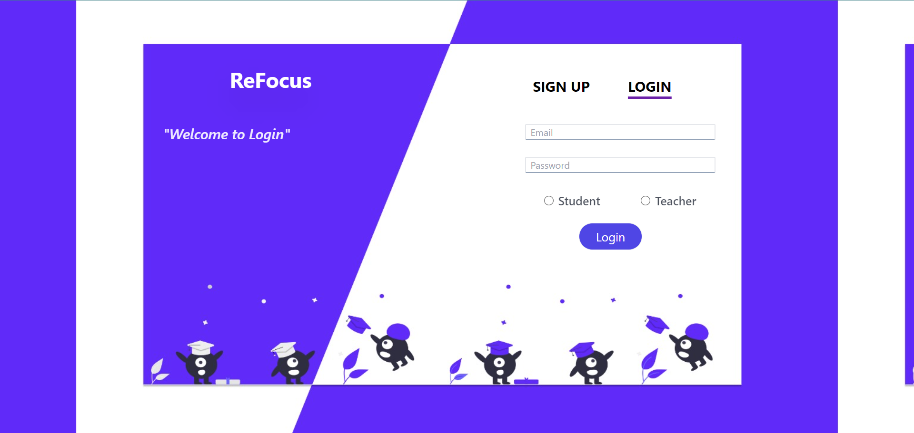
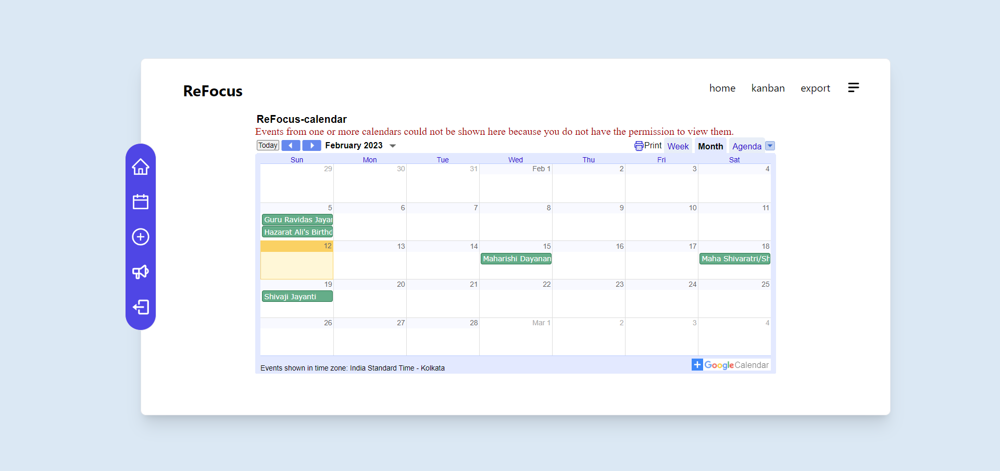
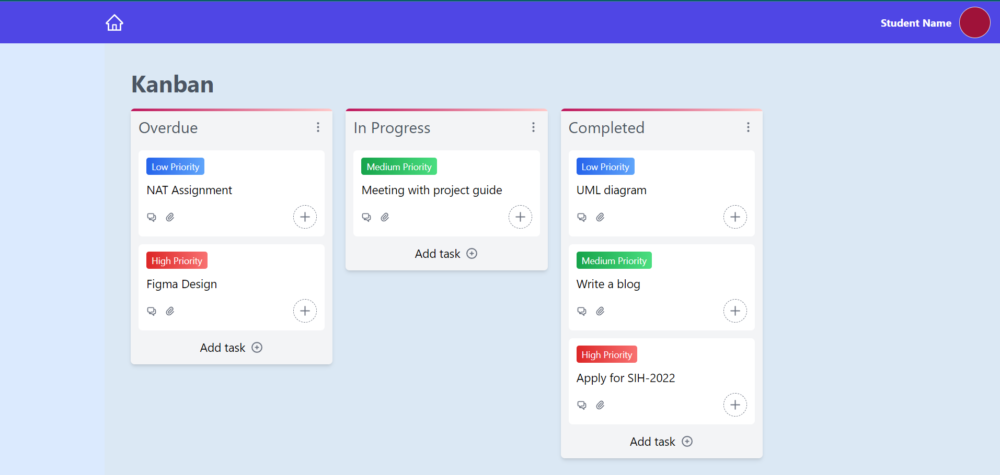
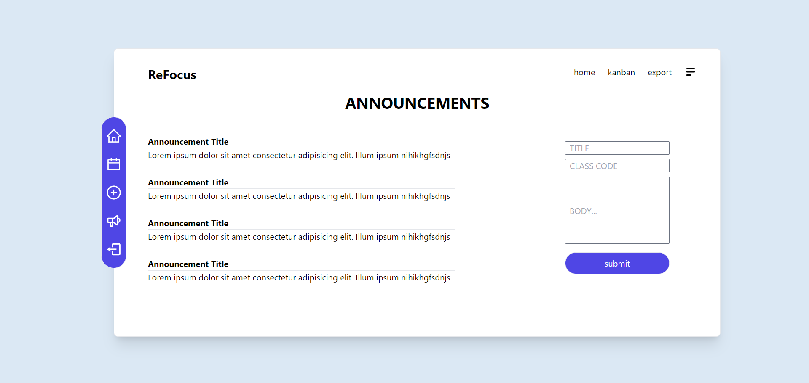
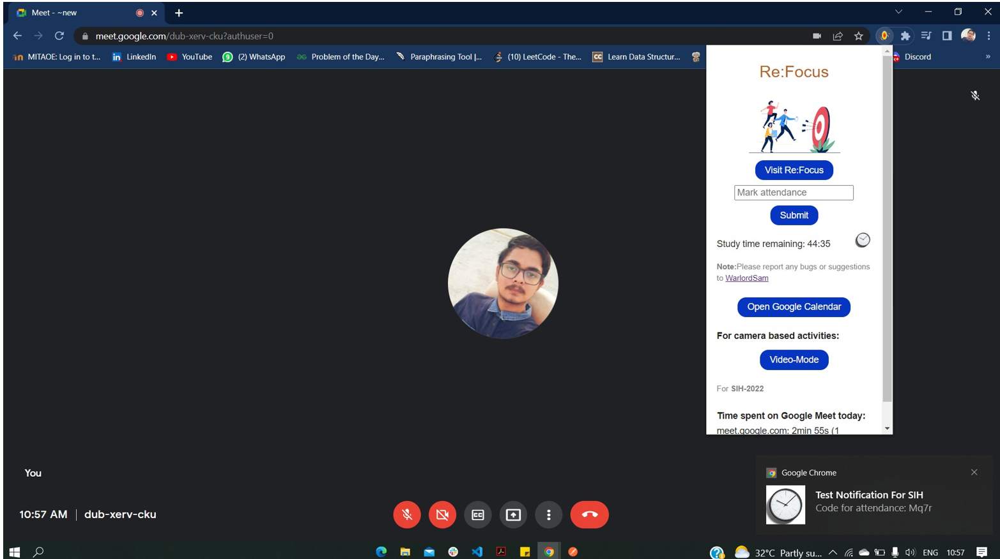
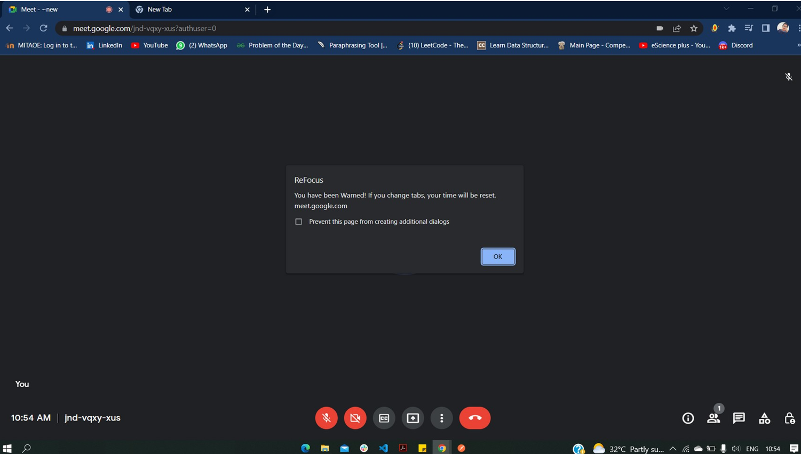

# Refocus - Improve Focus and Concentration

- Live Site URL: [Coming Soon]()
- Website Demo : [Coming Soon]()
- Chrome Extention Demo : [Extention Demo](https://tinyurl.com/55mm6a8d)
- Final Presentation : [PPT](https://tinyurl.com/2s49zwf6)

## ⚡Winner Smart India Hackathon 2022 🥉
- [Certificates and Memories](https://tinyurl.com/y978sf6y)

## Need Help 🚨
- We are building an initial release🤞 Our product will be launched very soon✔
- Need More Contributors and maintainers🤝
If intersted kindly contact [Here](#📬-contact)

## Table of contents

- [Overview](#overview)
  - [Screenshot](#screenshot)
  - [Links](#links)
- [Our process](#my-process)
  - [Built with](#built-with)
  - [What I learned](#what-i-learned)
  - [Continued development](#continued-development)
  - [Useful resources](#useful-resources)
- [Author](#author)
- [Acknowledgments](#acknowledgments)

## Overview

Refocusing aids in maintaining students' engaged engagement in the lesson, hence raising attention span. The enhanced Teacher Login gives instructors a variety of choices, allowing for greater student data analysis. It also permits exporting data for other uses. Students may keep track of their progress, scheduled activities, and study reports with the aid of the user-friendly dashboard. Using the Pomodoro approach, the student's goals for cognitive development and awareness during the brief intermission between tasks were met.

## My process

- Obeservation of the problem, Brainstroming a solution to Implmentation of solution and Deployment of the solution using my teamwork and leaderships skills.
- I used my knowledge of the MERN i have to build the Website.
- I designed and developed the complete backend for the website.
- Also colaborated with the front end of the website
- **All Links are in [Useful resources](#useful-resources).**

### What I learned

- Learned the complete MERN stack Development
- Detailed understanding of the backend and frontend
- Combined the frontend and backend to make a full stack application
- Had experience with MongoDb Atlas
- Learned how to deploy the app on heroku
- Enhanced my teamwork and leadership skills
### Built with

- Complete MERN Full Stack
- MongoDb Express React Node
- Chrome Extension using Javscript

## 🖥️ Tech Stack

**Frontend:**

&nbsp;
&nbsp;
&nbsp;
&nbsp;

**Backend:**

&nbsp;
&nbsp;
&nbsp;
&nbsp;
&nbsp;

**Deployed On:**

**Chrome Extension:**

### 🚀 Features🔥

- Web Extension
- Attendence and Activity Monitoring
- Pomodoro countdown timer
- Tab and window change monitoring
- Push API as a subscription service  Customized notification Generator 
- In-webapp Jitsi Meets
- Fetching calendar  
- Kanban board

### 😇 Upcoming Features🔥

- Multiple Activities at randomized
- Camera-based Activities: Face Detection
- Flexibility & Universality (Cross-platform  implementation) and Many more
## Sneak Peek 🙈

<table>
  <tr>
    <td></td>
    <td></td>
  </tr>
  <tr>
    <td></td>
    <td></td>
  </tr>
</table>

## Useful resources

- [Complete NodeJs Developer Bootcamp 2022](https://www.example.com) - This is the Udemy Course that i followed to learn NodeJs💛.
- [Thapa Technical](https://www.example.com) - This is the Youtube Channel that i followed to learn ReactJs💙.
- [Redux in One Video](https://www.example.com) - This is the Youtube Video that i followed to learn Redux💜.
- Also Some Online Blogs and Articles.

## 📬 Contact

If you want to contact me, you can reach me through below handles.

© 2022 Mitesh Tank ❤

